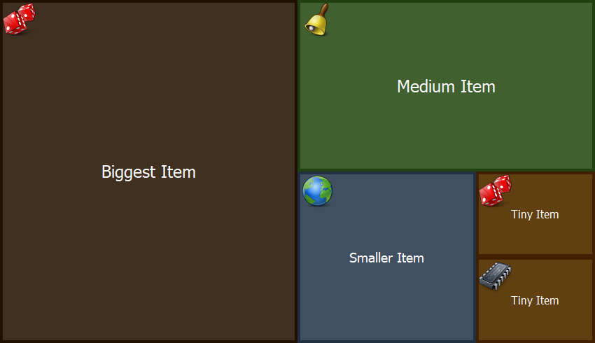

TreeMap Component for Delphi
============================

Copyright 2026 
by Rezar Behzad and Ingo Jache
https://www.fe1.com/treemap/

Introduction
------------

`TTreeMap` is a Delphi/VCL component that lays out and renders a list of items using the *squarified treemap* algorithm. The algorithm takes a list of items with associated weights and arranges them on a 2D surface as a set of rectangles: each rectangle's area reflects its item's weight relative to all items, while the layouter keeps the rectangles' aspect ratios as close to square as possible.

The component has decent performance, is customizable, and supports mouse interaction and selection. It is self-contained in a single Delphi unit and requires no third-party libraries.



The layouter is based on this paper:
https://vanwijk.win.tue.nl/stm.pdf

It explains the idea and the individual steps well, but its pseudocode and equations — in particular the one for computing the squariness — appear to be broken or at least misleading; this component uses a corrected implementation.


Installation
------------

There are two ways to install the component:

1. **Package-based:** double-click the corresponding `.dpk` file to open the package in Delphi, then right-click the package root and choose *Install*.

2. **No-install:** because the component is a single file, you can also drop it into your project folder or search path and use it from there.


Basic Usage
-----------

If you installed the package, just drag the TreeMap component onto your form and you are ready to go.

If you prefer to create it from code:

```pascal
MyTreeMap := TTreeMap.Create(Self);
MyTreeMap.Parent := Self;
```

There is no item editor in the IDE, but adding items is simple:

```pascal
var
  Item: TTreeMapItem;
begin
  Item := TTreeMapItem.Create(100, 'Item 1');
  MyTreeMap.Items.Add(Item);
end;
```

The constructor of `TTreeMapItem` has two mandatory parameters:

- **Size** (or "weight", if you like)
- **Caption** (the text to display on the item)

and three optional parameters:

- **BackgroundColor**
- **ForegroundColor**
- **Data** — an arbitrary pointer that links the item to your own data

Full example:

```pascal
TTreeMapItem.Create(10, 'Biggest Item', $203040, $F8F8F8, nil);
```

When adding large numbers of items, enclose your `Add`/`Remove` calls between `BeginUpdate` and `EndUpdate` to suppress redraws until every item has been added — just as you would with `TListBox` and other standard components.


Reacting to Input
-----------------

Assign `OnClickItem` or `OnDblClickItem` to respond to clicks; both handlers receive the clicked `TTreeMapItem`, the mouse button and the item's state. You can also look up the item under any point directly with `GetItemAt`.


Customization
-------------

The component has a default painter that styles each tile from a mix of the item's own properties and these component-level properties:

```pascal
MyTreeMap.BorderSize := 4;
MyTreeMap.BackgroundColor := clBlue;
MyTreeMap.SelectionColor := clYellow;
```

Tiles can also show an icon: assign an image list to `Images` and set each item's `ImageIndex`.

For full control, the TreeMap supports *custom drawing*, much like standard components such as `TListView`. Assign a handler to the `OnDrawItem` event:

```pascal
MyTreeMap.OnDrawItem := Self.CustomDrawItem;
```

```pascal
procedure TForm1.CustomDrawItem(
  Sender: TObject;              // the TTreeMap instance requesting the draw
  Canvas: TCanvas;              // the canvas to draw the item on
  Item: TTreeMapItem;           // the item to be drawn
  State: TTreeMapItemStates;    // the item's state: hover, selected
  var Area: TRect               // the rectangle to draw the item in
);
begin
  // ...
end;
```

Note that `Area` is a `var` parameter. If your items are nested (top-level items have children), you may want to draw the parent as a thin title bar and let the children fill the remaining space. To have the children laid out and drawn, leave that remaining space in `Area`; to suppress them, set `Area` to `Rect(0, 0, 0, 0)`:

```pascal
procedure TForm1.CustomDrawItem(
  Sender: TObject;
  Canvas: TCanvas;
  Item: TTreeMapItem;
  State: TTreeMapItemStates;
  var Area: TRect
);
const
  TitleBarSize = 48;
var
  PaintArea: TRect;
begin
  if not Item.HasChildren then
  begin
    // no children: use the entire area
    PaintArea := Area;
    Area := Rect(0, 0, 0, 0);
  end
  else
  begin
    // children will be drawn: split the space
    PaintArea := Rect(Area.Left, Area.Top, Area.Right, Area.Bottom - TitleBarSize);
    Area := Rect(Area.Left, Area.Top + TitleBarSize, Area.Right, Area.Bottom);
  end;
  // ... paint the item into PaintArea ...
end;
```


Demos
-----

- There is a `simple` demo that shows the shortest possible usage of the TreeMap component.
- There is a `showcase` demo that goes further: mouse interaction, nested treemaps and rendering to bitmaps.
